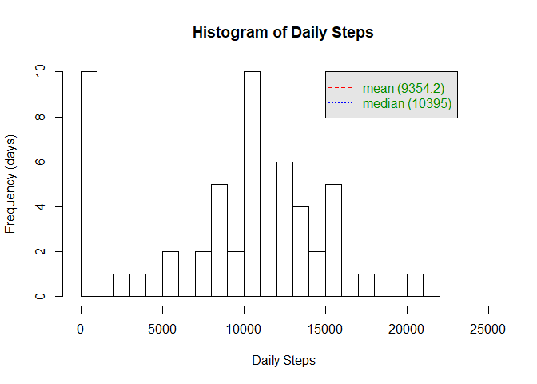
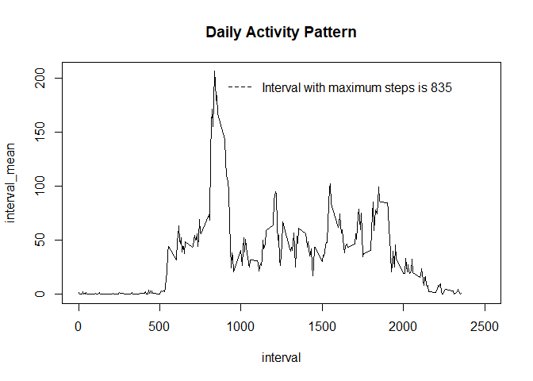

## unzip the file and load data


```r
unzip("activity.zip")
activitydata <- read.csv("activity.csv")
```

## Load required packages


```r
library(dplyr); library(lubridate); library(reshape2); library(tidyr); library(ggplot2); library(lattice)
```

```
## 
## Attaching package: 'dplyr'
```

```
## The following objects are masked from 'package:stats':
## 
##     filter, lag
```

```
## The following objects are masked from 'package:base':
## 
##     intersect, setdiff, setequal, union
```

```
## 
## Attaching package: 'lubridate'
```

```
## The following object is masked from 'package:base':
## 
##     date
```

```
## 
## Attaching package: 'tidyr'
```

```
## The following object is masked from 'package:reshape2':
## 
##     smiths
```

## Question 1: What is mean total number of steps taken per day?
a. Calculate the total number of steps taken per day
b. Make a histogram of the total number of steps taken each day
c. Calculate and report the mean and median of the total number of steps taken per day


```r
df1 <- activitydata %>% group_by(date) %>% summarize (
        dailytotal = sum(steps, na.rm = TRUE)
)

hist(df1$dailytotal, breaks = 20, main = "Histogram of Daily Steps",
     xlab = "Daily Steps", ylab = "Frequency (days)", xlim = c(-100, 25000),
     ylim = c(0, 10))

mean_text <- paste0("mean", " (", round(mean(df1$dailytotal), 1), ")")
median_text <- paste0("median", " (", round(median(df1$dailytotal),1), ")")
legend(15000, 10, c(mean_text, median_text), col = c("red", "blue"),
       text.col = "green4", lty = c(2, 3), merge = TRUE, bg = "gray90")
```

<!-- -->

## Question 2: What is the average daily activity pattern?
a. Make a time series plot (i.e. type = "l") of the 5-minute interval (x-axis) and the average number of steps taken, averaged across all days (y-axis)
b. Which 5-minute interval, on average across all the days in the dataset, contains the maximum number of steps?


```r
df2 <- activitydata %>% group_by(interval) %>% summarize(
        interval_mean = mean(steps, na.rm=T)
)
max_step_interval <- df2[which.max(df2$interval_mean), 1]

with(df2, plot(interval, interval_mean, type = "l", xlim = c(0, 2500), main="Daily Activity Pattern"))
legend(max_step_interval+20, df2[which.max(df2$interval_mean), 2], paste0("Interval with maximum steps is ", max_step_interval), lty = 2, bty = "n")
```

<!-- -->

## Question 3: Imputing missing values and recalculate daily mean
a. Calculate and report the total number of missing values in the dataset
b. Devise a strategy for filling in all of the missing values in the dataset.
c. Create a new dataset that is equal to the original dataset but with the missing data filled in.
d. Make a histogram of the total number of steps taken each day and Calculate and report the mean and median total number of steps taken per day. Do these values differ from the estimates from the first part of the assignment? What is the impact of imputing missing data on the estimates of the total daily number of steps?


```r
total_missing <- sum(is.na(activitydata$steps))
print(paste0("Total number of missing values is ", total_missing, "."))
```

```
## [1] "Total number of missing values is 2304."
```

```r
## Create a new dataset with missing valued filled
activitydata2 <- activitydata %>% group_by(interval) %>% mutate(
        steps2 = ifelse(is.na(steps) == TRUE, mean(steps, na.rm = T), steps)
)

df3 <- activitydata2 %>% group_by(date) %>% summarize (
        new_dailytotal = sum(steps2),
        previous_dailytotal = sum(steps, na.rm = TRUE)
)


df3long <- melt(df3, id=c("date"))
names(df3long) <- c("date", "category", "steps")

ggplot(df3long, aes(x=steps)) + 
        geom_histogram(bins = 20) + facet_grid(category~.) + ylab("Number of days")
```

<!-- -->

```r
df3r <- df3long %>% select(category, steps) %>% group_by(category) %>% summarize_all(funs(mean, median))%>%data.frame()

df3r
```

```
##              category     mean   median
## 1      new_dailytotal 10766.19 10766.19
## 2 previous_dailytotal  9354.23 10395.00
```

## Question 4: Are there differences in activity patterns between weekdays and weekends?
a. Create a new factor variable in the dataset with two levels - "weekday" and "weekend" indicating whether a given date is a weekday or weekend day.
b. Make a panel plot containing a time series plot (i.e. type = "l") of the 5-minute interval (x-axis) and the average number of steps taken, averaged across all weekday days or weekend days (y-axis). 


```r
df4 <- activitydata2[, 2:4]
df4$wkd <- weekdays.Date(date(df4$date))
df4$wkd <- ifelse(df4$wkd=="Saturday" | df4$wkd == "Sunday", "Weekend", "Weekday")
df4$wkd <- factor(df4$wkd, levels= c("Weekday", "Weekend"))

## Process data table
df4a <- df4[, 2:4]
df4long <- melt(df4a, id=c("interval", "wkd"))
df4final <- dcast(df4long, interval+wkd~variable, mean)

## Panel plot results
with(df4final, xyplot(steps2~interval | wkd, layout=c(1:2), type="l", xlab = "Interval", ylab = "Average Steps", main = "Weekend and Weekday Activity Comparison"))
```

<!-- -->
